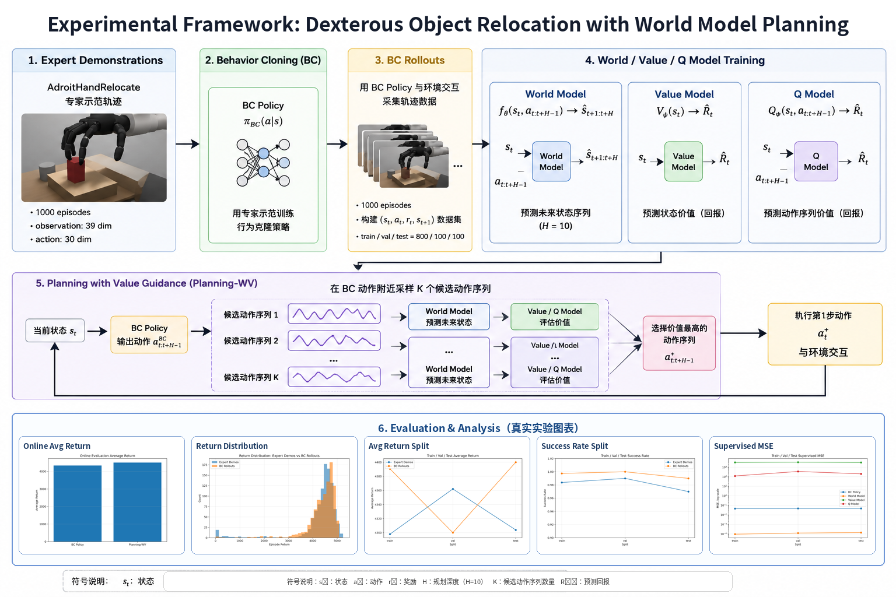
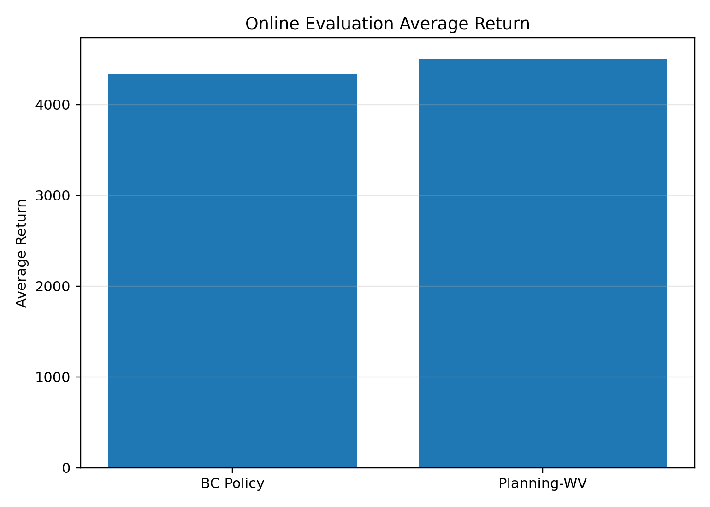
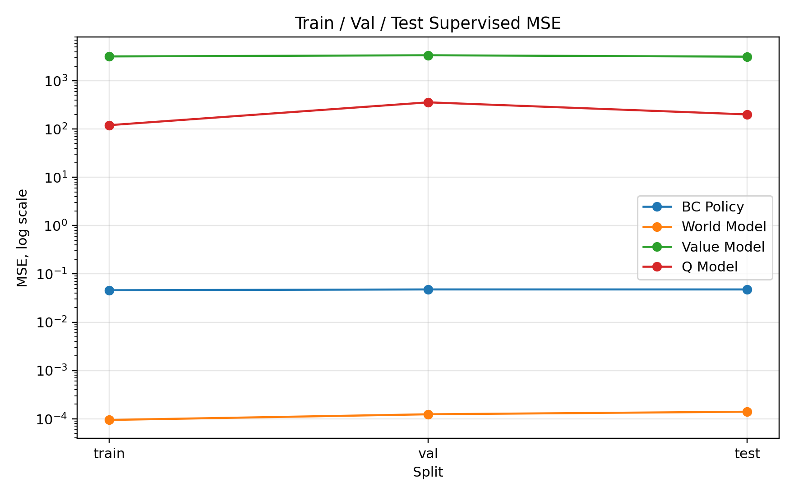
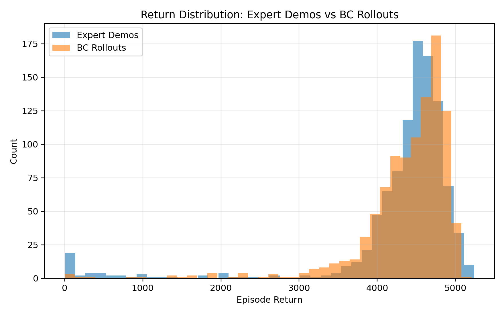

# World-Model-Guided Planning for Dexterous Object Relocation

This project implements a lightweight experimental pipeline for dexterous manipulation using expert demonstrations, behavior cloning, world model learning, and value-guided planning.

The task is based on `AdroitHandRelocate`, where a dexterous robotic hand is required to relocate an object to a target position.

## Overview

The full pipeline is:

```text
Expert Demonstrations
        ↓
Behavior Cloning Policy
        ↓
BC Rollouts
        ↓
World Model / Value Model / Q Model
        ↓
Planning-WV
        ↓
Online Evaluation + Visualization
```

The goal is to first learn a strong imitation policy from expert demonstrations, and then use a learned world model and value-based planning to further improve trajectory quality.

## Task

| Item                  | Description                                  |
| --------------------- | -------------------------------------------- |
| Environment           | `AdroitHandRelocate`                         |
| Observation dimension | 39                                           |
| Action dimension      | 30                                           |
| Episode length        | 200 steps                                    |
| Demonstration source  | `D4RL/relocate/expert-v2`                    |
| Dataset interface     | Minari                                       |
| Planning horizon      | 10                                           |
| Main metrics          | success rate, average return, supervised MSE |

## Method

### Behavior Cloning Policy

The behavior cloning policy is trained from expert demonstrations.

Input:

```text
observation: 39 dimensions
```

Output:

```text
action chunk: horizon × action_dim = 10 × 30 = 300 dimensions
```

The policy learns to imitate expert action chunks using supervised learning.

### World Model

The world model predicts future observations from the current observation and a candidate action chunk.

```text
input:  observation + action chunk = 39 + 300 = 339
output: future observation = 39
```

### Value Model

The value model predicts the future return or value score of a state.

```text
input:  observation = 39
output: value score = 1
```

### Q Model

The Q model predicts the quality of a state-action-chunk pair.

```text
input:  observation + action chunk = 339
output: Q score = 1
```

### Planning-WV

During evaluation, the planner samples candidate action chunks around the BC policy output. Each candidate is evaluated using the learned world model and value model. The best-scoring action chunk is selected, and only the first few steps are executed before replanning.

```text
BC action chunk
        ↓
sample candidate action chunks
        ↓
predict future states with world model
        ↓
score candidates with value / Q models
        ↓
execute best action chunk
```

## Dataset

The experiment uses 1000 expert demonstrations and 1000 BC rollouts.

| Dataset               | Train | Validation | Test |
| --------------------- | ----: | ---------: | ---: |
| Expert demonstrations |   800 |        100 |  100 |
| BC rollouts           |   800 |        100 |  100 |

The expert demonstrations are used to train the BC policy.
The BC rollouts are used to train the world model, value model, and Q model.

## Main Results

Online evaluation over 100 episodes:

| Method      | Success Rate | Average Return |
| ----------- | -----------: | -------------: |
| BC Policy   |          1.0 |        4337.64 |
| Planning-WV |          1.0 |        4507.41 |

Planning-WV maintains a 100% success rate and improves the average return by approximately 3.91% over the direct BC policy.

## Train / Validation / Test Evaluation

| Model       | Train MSE |   Val MSE |  Test MSE |
| ----------- | --------: | --------: | --------: |
| BC Policy   |   0.04595 |   0.04770 |   0.04767 |
| World Model | 0.0000945 | 0.0001239 | 0.0001400 |
| Value Model |   3190.69 |   3373.37 |   3156.09 |
| Q Model     |    120.30 |    357.71 |    201.11 |

The BC policy and world model show good generalization across train, validation, and test sets.
Value and Q models have larger errors due to the scale and difficulty of return prediction.

## Figures

### Method Framework



### Online Average Return



### Train / Val / Test Supervised MSE



### Return Distribution



## Installation

Create a conda environment:

```bash
conda create -n dex_wm python=3.10
conda activate dex_wm
```

Install dependencies:

```bash
pip install -r requirements.txt
```

The main dependencies include:

```text
torch
numpy
pandas
matplotlib
gymnasium
gymnasium-robotics
minari
imageio
pillow
tqdm
pyyaml
tabulate
```

## Dataset Preparation

Download the Minari dataset:

```bash
minari download D4RL/relocate/expert-v2
```

Convert Minari demonstrations to `.npz` trajectory files:

```bash
python -m src.convert_minari_demos \
  --dataset_id D4RL/relocate/expert-v2 \
  --out_dir data/demos_expert1000 \
  --max_episodes 1000 \
  --clear_old
```

Split expert demonstrations into train / validation / test sets:

```bash
python -m src.split_dataset \
  --src_dir data/demos_expert1000 \
  --out_root data/splits/demos_expert1000 \
  --prefix demos_expert1000 \
  --seed 42
```

## Training

Train the BC policy:

```bash
python -m src.train_policy \
  --config configs/adroit_relocate_expert1000.yaml
```

Evaluate the BC policy:

```bash
python -m src.evaluate_bc \
  --config configs/adroit_relocate_expert1000.yaml
```

Collect BC rollouts:

```bash
python -m src.collect_bc_rollouts \
  --config configs/adroit_relocate_expert1000.yaml \
  --episodes 1000
```

Split BC rollouts:

```bash
python -m src.split_dataset \
  --src_dir data/rollouts_bc_expert1000_raw \
  --out_root data/splits/rollouts_bc_expert1000 \
  --prefix rollouts_bc_expert1000 \
  --seed 42
```

Train the world model:

```bash
python -m src.train_world \
  --config configs/adroit_relocate_expert1000_wm.yaml
```

Train the value and Q models:

```bash
python -m src.train_value_q \
  --config configs/adroit_relocate_expert1000_wm.yaml
```

## Evaluation

Evaluate Planning-WV:

```bash
python -m src.evaluate_planning \
  --config configs/adroit_relocate_expert1000_wm.yaml
```

Evaluate supervised train / validation / test MSE:

```bash
python -m src.evaluate_supervised_splits \
  --config configs/adroit_relocate_expert1000_wm.yaml \
  --demo_root data/splits/demos_expert1000 \
  --rollout_root data/splits/rollouts_bc_expert1000 \
  --out_csv reports/supervised_split_eval_expert1000.csv \
  --out_md reports/supervised_split_eval_expert1000.md
```

## Visualization

Generate figures:

```bash
python -m src.plot_expert1000_results
```

Generate enhanced videos:

```bash
export MUJOCO_GL=egl

python -m src.render_enhanced_video \
  --config configs/adroit_relocate_expert1000.yaml \
  --mode bc \
  --out reports/videos_expert1000_enhanced/bc_expert1000_enhanced.mp4 \
  --seed 42

python -m src.render_enhanced_video \
  --config configs/adroit_relocate_expert1000_wm.yaml \
  --mode planning \
  --planner_mode wv \
  --out reports/videos_expert1000_enhanced/planning_wv_expert1000_enhanced.mp4 \
  --seed 42
```

## Notes

This project is not an official reproduction of EgoScale or NVIDIA GR00T N1.7.

It is a lightweight research prototype inspired by expert demonstration learning, behavior cloning, world model learning, and value-guided planning for dexterous manipulation.

Large files such as datasets, rollouts, checkpoints, and videos are not included in this repository. They can be regenerated by following the commands above.

## Future Work

* Conservative BC-guided planning
* Return normalization for Value / Q models
* Low-data demonstration experiments
* Planning parameter ablations
* Multi-seed evaluation
* Residual world model prediction
* Extension to vision-based observations and larger VLA models
